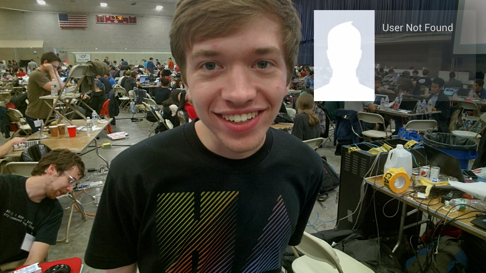

# Glassface

Glassface is an app that lets you add friends on social networks by looking at their faces with [Google Glass]((https://glass.google.com).



Say, for example, that you just met some cool people at a hackathon and you want to add them on Facebook. In a natural conversation, just say _"Ok Glass, add this person on the web."_ Your Google Glass will take a picture of your new acquaintance and upload it to the cloud for facial recognition, then display the matched profile to you for confirmation. With respect to privacy, the service is limited to users that opt-in to link their Facebook, Twitter, and Google+ accounts.

This hack was developed by @derek-schultz, @daniel-bulger, @alexkau, and @theopak for HackMIT October 2013.


## Thanks

Development was made possible by the wonderful sponsors and organizers of [HackMIT](http://www.hackmit.org/) in Boston, MA, in October 2013.

Thanks also to the [Smart Lighting ERC](http://smartlighting.rpi.edu/) at Rensselaer Polytechnic Institute in Troy, NY, for their contributions to the community at RPI, which made possible the use of Google Glass in this hack.


## Security

Please excuse the glaring security holes in this prototype implementation. Don't actually use your real social network accounts with this service, which may or may not violate all the policies of everything.


## Contributing

### Building OpenCV From Source

This project uses OpenCV for facial recognition. It is required that you build OpenCV from source. Here's how to do it:

1. Download the [source code](http://opencv.org/downloads.html) to your local development machine.
2. From inside the folder, build the source:

```bash
cd opencv-2.4.6.1 # Change to the downloaded (unzipped) directory
mkdir build
cd build
cmake -D BUILD_PYTHON_SUPPORT=ON  # We're building from source just for this feature
make
sudo make install 
```

### Screen Mirroring Glass on Your Development Machine

This [helpful guide](http://neatocode.tumblr.com/post/49566072064/mirroring-google-glass) describes how to use [asm.jar](asm.jar) to screen mirror.
